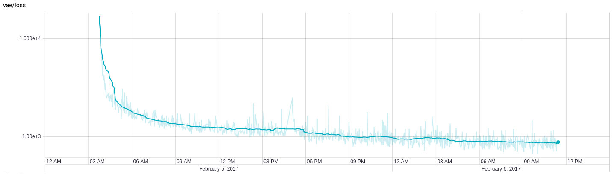
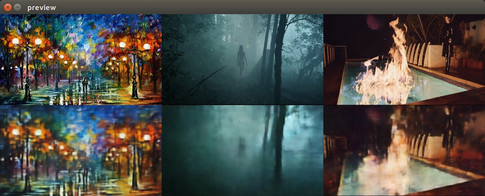
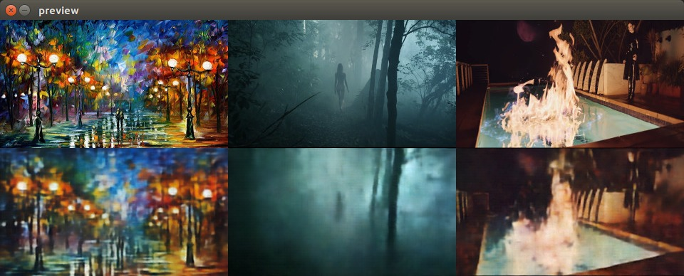
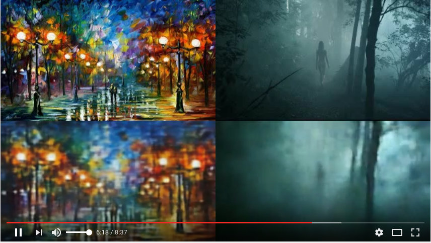
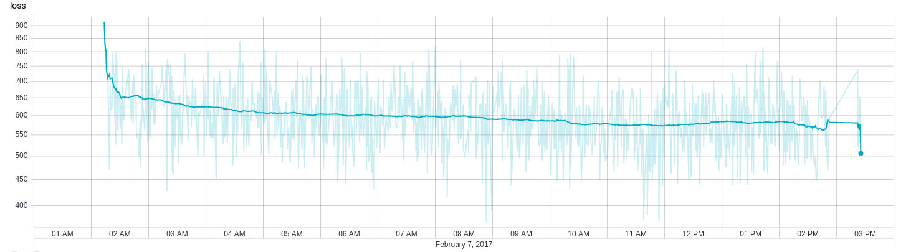
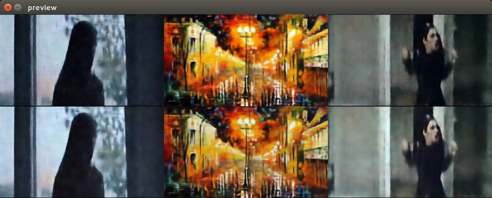

# Convolutional VAE Style Transfer

The project was created as part of the [Creative Applications of Deep Learning with TensorFlow](kadenze.com/courses/creative-applications-of-deep-learning-with-tensorflow-iv)
(CADL) Kadenze course's final assignment. It is an experimental attempt to transfer artistic style
learned from a series of paintings "live" onto a video sequence by fitting
a variational autoencoder with 512 codes to both paintings and video
frames, isolating the mean feature-space embeddings and modifying the
video's embeddings to be closer to those of the paintings.

Because the general visual quality of the VAE's decoded output is relatively low,
a convolutional post-processing network based on residual convolutions was trained 
with the purpose of making the resulting image less similar
to the VAE's generated output and more similar to the original input images.
The basic idea was to have an upsampling network here, but it quickly turned out
to be a very naive idea at this point of development. Instead, it now
downsizes the input, learns filters in a residual network and then samples back
up to the input frame size; I would have liked to perform convolutions directly
on the input, but memory limitations prevented the usage of a useful amount of
feature maps.

The combined network makes the processing pipeline consist of an encoder, a
variational embedding, a decoder and a generator; sort of a three-quarter deep 
convolutional VAEGAN architecture minus the adversarial training. No cross-validation, 
dropout or regularization procedures have been used in order to get the network 
to as closely fit the inputs as possible. 

Image frame size was fixed to 320x180 because of said memory limitations;
The VAE uses 6 layers with increasing feature map sizes in an attempt
to make up for this. Training the whole network took about three days
on an Nvidia GTX 980TI.

## Training inputs

The paintings and videos used are:

* [Leonid Afremov](http://leonidafremov.deviantart.com/gallery/)'s DeviantArt gallery
* [Disclosure - Magnets](https://www.youtube.com/watch?v=b_KfnGBtVeA) music video
* [Wim - See You Hurry](https://vimeo.com/22328077) music video

Because more video frames were available than paintings, only every tenth
frame was used from them. Black borders have been cropped and the frames
were resampled to 320x180, RGB.

Finally, the trained VAE was used on a video unrelated to the training process,

* [Pentatonix - Daft Punk](https://www.youtube.com/watch?v=3MteSlpxCpo)

## Resulting media

The evaluation script creates video-only MP4 files to which I added back the music
from the original videos using `ffmpeg`. Some videos have been uploaded
to Vimeo. For copyright reasons, the videos are protected with the password

    cadl

You can find them here

* [CADL VAE Style Transfer on Pentatonix - Daft Punk](https://vimeo.com/202984113)
* [CADL VAE Style Transfer on Wim - See You Hurry](https://vimeo.com/202979720)
* [CADL VAE Style Transfer on Disclosure - Magnets](https://vimeo.com/202991439)

The _Daft Punk_ video is, in my opinion, by far the most interesting: Because the
input was never seen during training, the network had to make things up on its own.
For _See You Hurry_ and _Magnets_, movement is a bit choppy due to the
reduced amount of frames the network was trained on. It can also be seen that faster
motion tends to correlate with more colorful rendition, whereas the fog
in the See You Hurry video doesn't do the video any favor at all.

## Training process

Data is extracted using `extract_tiles.py` and written to `.tfrecord.gz`
files for later usage. The `preview_tiles.py` script is used to
validate correctness.

`train_vae.py` performs the actual training based on the TFRecord files.
The network was pre-trained using See You Hurry and the Afremov paintings,
to which I later added the Magnets video frames (that part went well).
Learning that VAE is _very_ slow, although adding another training set
did not appear to make it worse. I stopped training the VAE after
approximately 30 hours and left the refining network running for about
12 hours, at which point improvement was noticeable, yet very subtle.

The `export_graphs.py` script takes the network checkpoints produced by
TensorFlow's Supervisor and exports them as reusable protocol buffer
files. The `evaluate*.py` load these files in order to perform inference
and some tests on the latent embedding vectors.

Finally, `mogrify_video.py` is used to process videos using the network.

### Impressions from the VAE training process

After the VAE training reached a certain point, convergence slowed down.
The following graph depicts the change of loss over about 31 hours, 
where the bump/spike at 3pm (12 hours in) depicts the moment I added
the second video to the learning process. Note that the loss scale is logarithmic.

This is a screenshot about nineteen hours into the learning process ...

... while this is about four hours later.

A video of the learning progress over about 9000 batch iterations is
assembled here:

### Impressions from the refinement network training process

The following graph depicts the change of loss over about 12 hours,
again with logarithmic loss scale:

The below screenshot shows the output of the VAE on the top and the
refined images on the bottom after training; note that the images appear to feature
sharper edges and smoother areas.

## Further experiments

In order to get a cleaner outcome, I assume a real VAEGAN approach might
be more fruitful.

## Copyright and Licenses

The original videos and paintings are copyrighted by their respective
copyright holders and used only in a _fair use_ context.
The VAE implementation and related utilities are copyrighted by Parag Mital (2016) and can be
found on his [CADL repository](https://github.com/pkmital/CADL).
